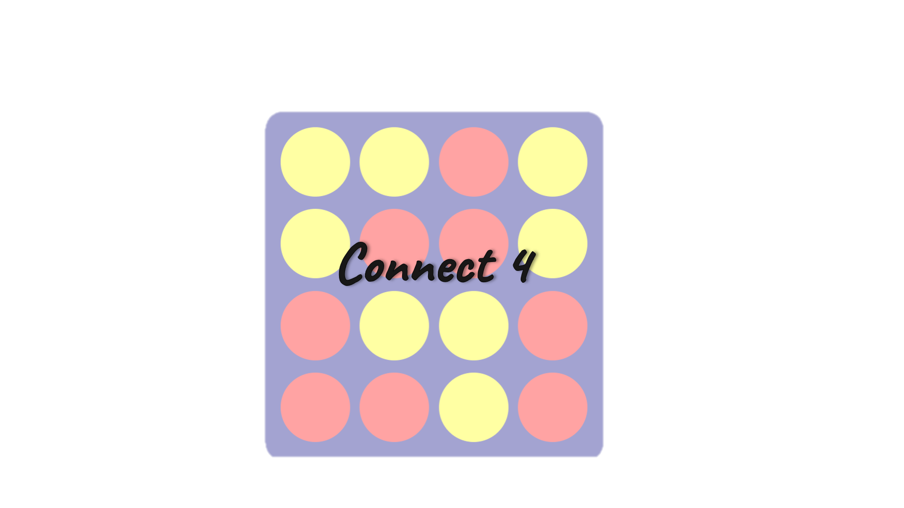

# Connect-4
GA's SEI Course Project #1: Connect 4

## Installation
No prior installation is required, the game could be accessed by following this <a href="">link</a>

## Technologies Used
* HTML.
* CSS.
* Java Script.
* jQuery.

## How the code works

### Checking for a winner

## Features
* Score tracking (all game result cases).
* Start a new round of the game.
* An announcement message that is used for:
  * Stating the number of the current round.
  * Announcing the game results
* Using different coloring styles to indicate changes in the game, such as telling the players who's turn is now, or announcing the winner.
* Added audio to mimic the sound of clicks and to use the other as a notification in case of winning.

## Other Features (that require some improvements)
The following features are not functioning perfectly at the moment, but would do with some modification.
* <b>Making the site fully responsive:</b> As it needs to be modified to fit mobiles with bigger screens (and include tablets as well).
* <b>Allowing the players to customize their names</b>

## Video

## Screenshots:

